# FE-10 Accessibility and Performance Audit

## AI Study Planner

This audit evaluates the AI Study Planner application for accessibility and mobile performance as part of FE-10: Accessibility and Performance Audit.

Testing was performed using Lighthouse Mobile, WAVE, and keyboard-only navigation on the deployed application.

---

## 1. Lighthouse Baseline and Final Results

Scores are shown as:

**Performance / Accessibility**

| Page | Before | After |
|---|---:|---:|
| Home | 77 / 95 | **89 / 95** |
| Dashboard | 94 / 95 | **94 / 95** |
| Planner | 79 / 100 | **94 / 100** |
| AI Assistant | 90 / 95 | **94 / 95** |
| Subjects | 84 / 100 | **84 / 100** |
| Tasks | 77 / 100 | **85 / 100** |
| Calendar | 83 / 95 | **83 / 95** |

The Lighthouse mobile audit was performed using Chrome DevTools with mobile emulation and throttled network/CPU conditions.

Lighthouse results can vary between runs because of browser CPU load, network conditions, caching, and throttling. The scores above correspond to the recorded before/after screenshots used for this audit.

---

## 2. Lighthouse Screenshots

### Home

#### Before

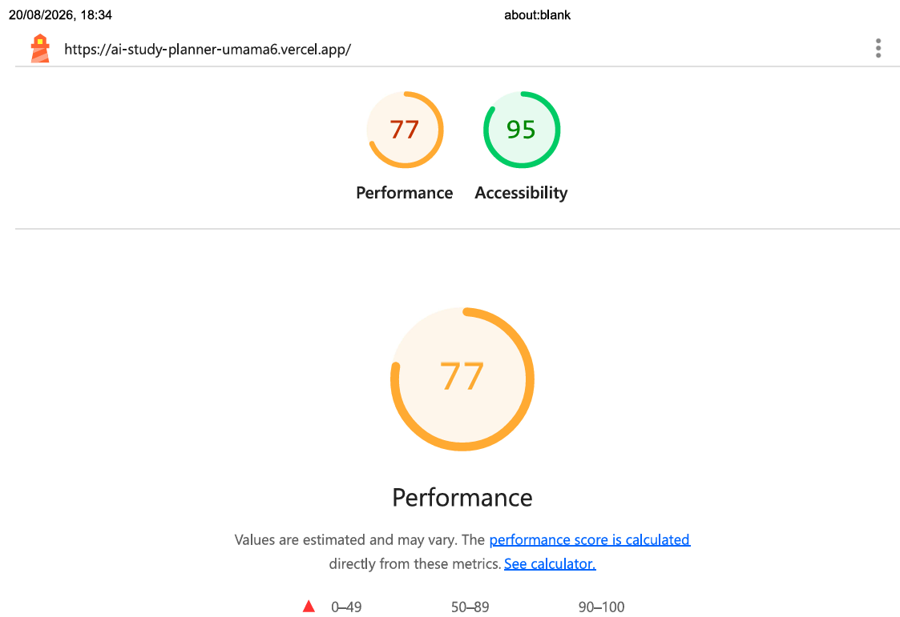

#### After

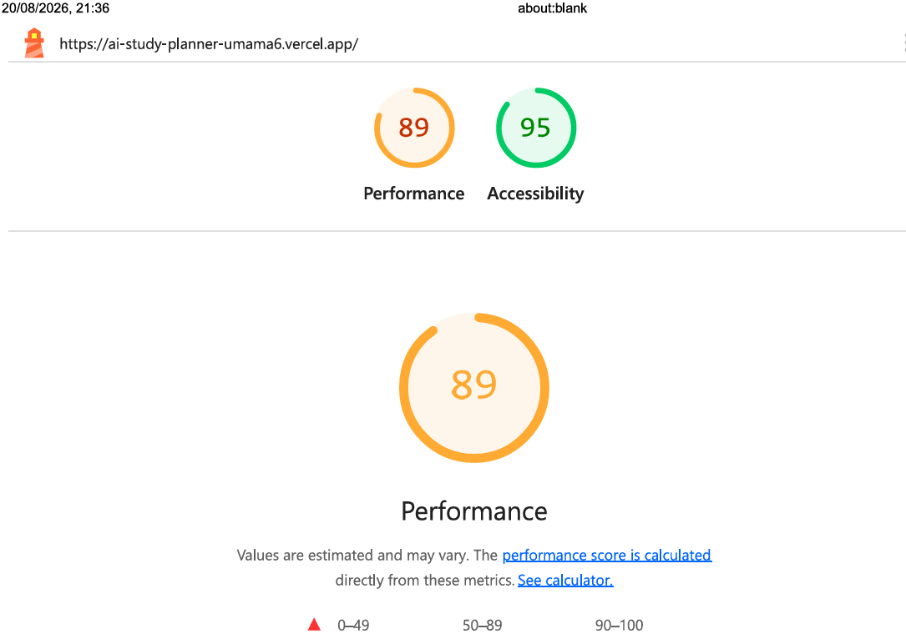

---

### Dashboard

#### Before

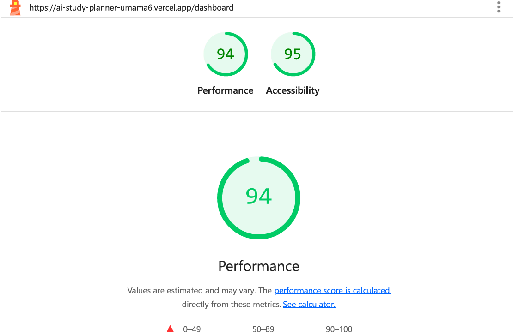

#### After


---

### Planner

#### Before

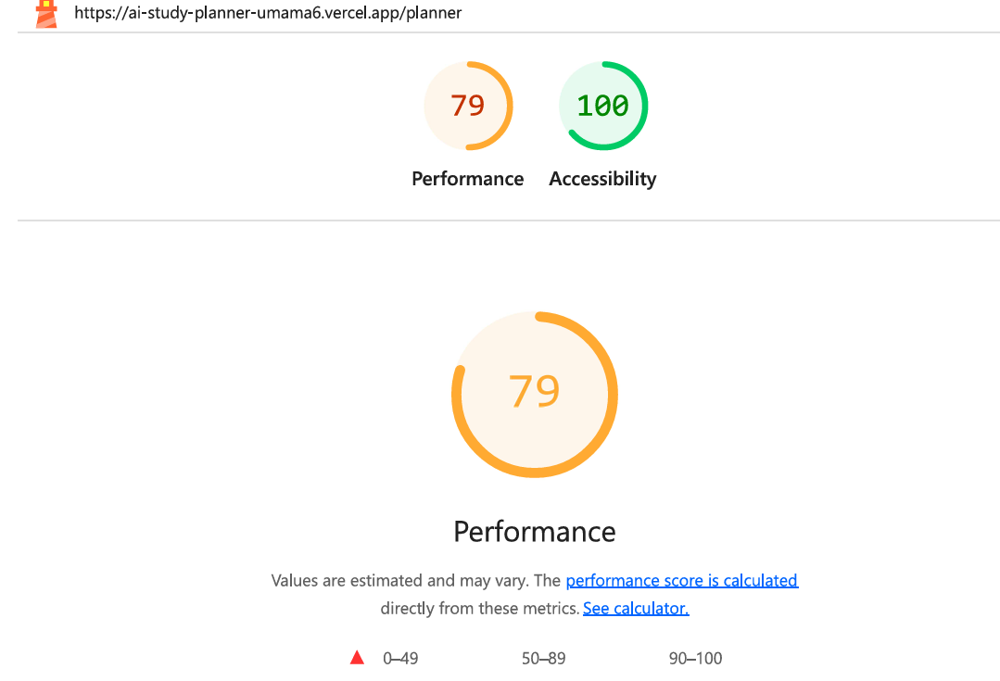

#### After

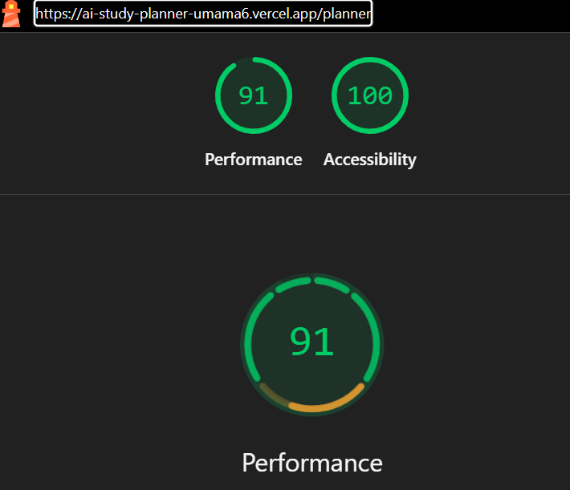

---

### AI Assistant

#### Before


#### After

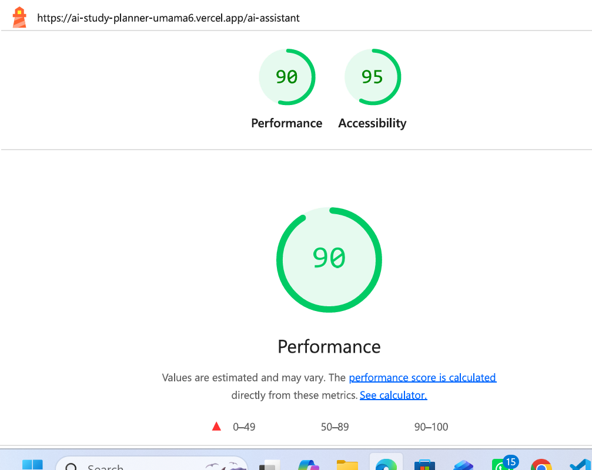

---

### Subjects

#### Before

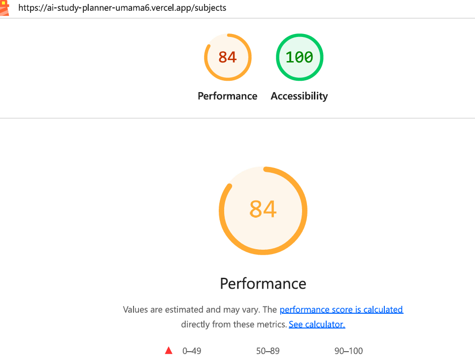

#### After


---

### Tasks

#### Before

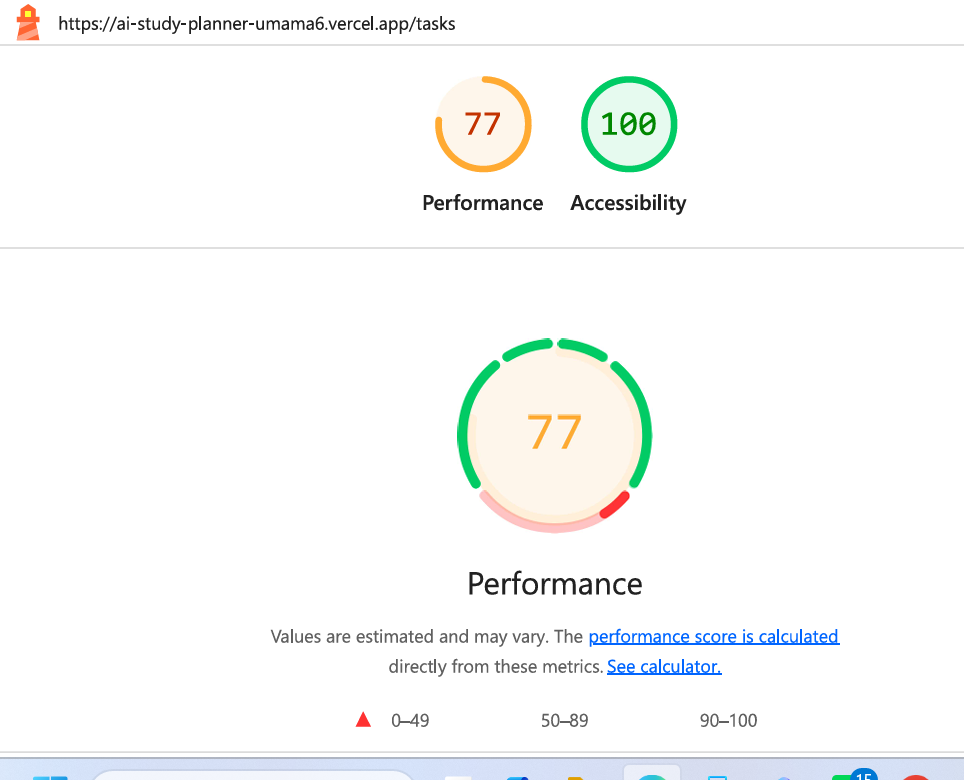

#### After

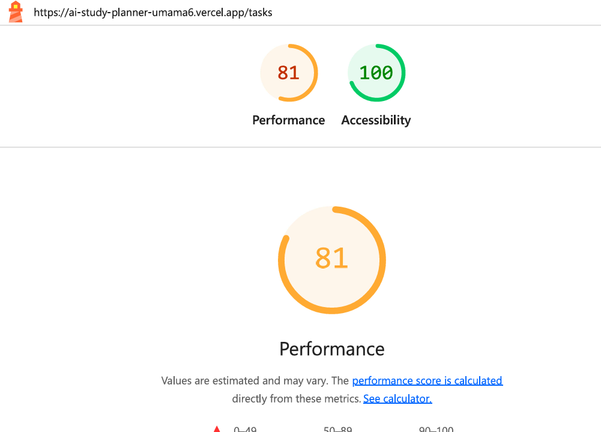

---

### Calendar

#### Before

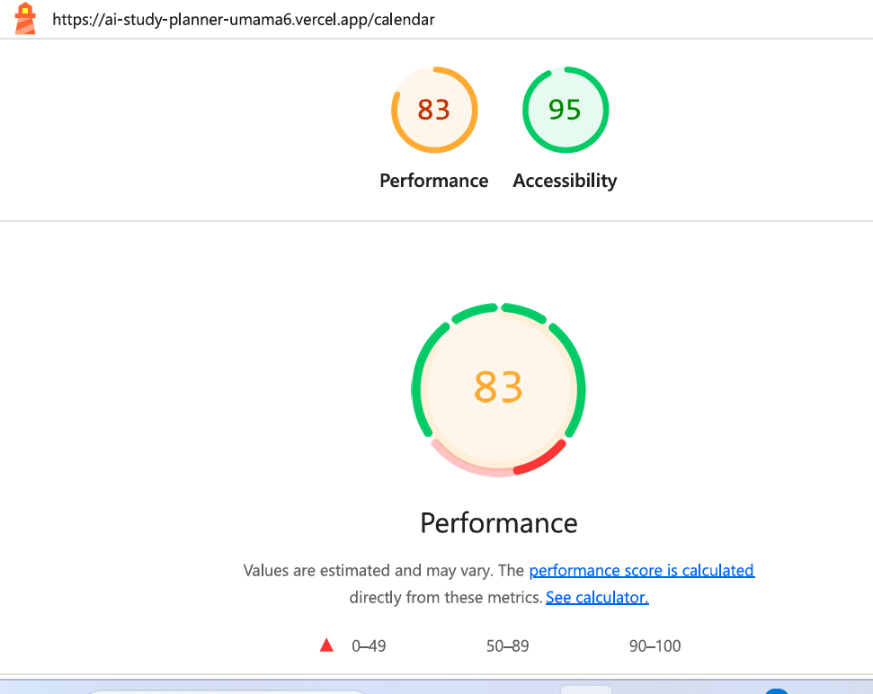

#### After


---

## 3. Accessibility Improvements

The following accessibility improvements were implemented during the audit:

- Added `lang="en"` to the root HTML element.
- Added semantic `header` and `main` landmarks.
- Used semantic heading structure throughout the application.
- Added labels to form inputs and select controls.
- Added `aria-invalid` and `aria-describedby` to fields with validation errors.
- Added accessible error messages using `role="alert"`.
- Added accessible labels to task completion checkboxes.
- Added accessible labels to task delete buttons.
- Added visible keyboard focus states to interactive controls.
- Used native buttons, links, inputs, selects, and textarea controls.
- Added `aria-live="polite"` to streamed AI assistant responses.
- Ensured the AI Assistant Stop button is a keyboard-reachable native button.
- Added accessible labels to AI Assistant controls.
- Added status messaging for dynamic AI planner feedback.

---

## 4. WAVE Testing

WAVE was used to evaluate the key application pages.

The initial WAVE results identified:

- Missing or invalid page language.
- Missing page regions.

These issues were addressed by:

- Adding `lang="en"` to the root `<html>` element.
- Adding semantic page landmarks such as `<header>` and `<main>`.

WAVE also reported no contrast errors on the tested pages.

The remaining WAVE findings were reviewed and did not indicate additional critical accessibility errors requiring changes.

### WAVE Audit Screenshot

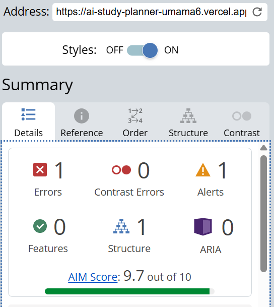

---

## 5. Keyboard-Only Testing

The primary application flow was tested using keyboard navigation.

The following controls were verified:

- Navigation links
- Home page actions
- Planner form controls
- Task form controls
- Add Task button
- Task completion checkbox
- Task delete button
- Calendar previous/next controls
- Calendar Today button
- AI Assistant suggestion buttons
- AI Assistant text input
- Send button
- Stop generation button
- Retry response button

Interactive controls were reachable using the `Tab` key and could be activated using keyboard controls such as `Enter` and `Space`.

The AI Assistant Stop button was also verified to be keyboard reachable while an AI response was generating.

---

## 6. AI-Specific Accessibility

The AI Assistant contains dynamically streamed content.

To improve accessibility for streamed responses, the assistant message container uses:

```tsx
aria-live="polite"

This allows assistive technologies to announce new AI content without aggressively interrupting the user.

The Stop button is implemented as a native keyboard-accessible <button> and is available while an AI response is streaming.

7. Performance Improvements

Performance optimization focused on reducing unnecessary client-side work and improving the efficiency of interactive pages.

Improvements included:

Reduced unnecessary client-side processing.
Simplified task handling and rendering.
Improved form handling and validation.
Reduced unnecessary state updates where possible.
Improved page structure and semantic HTML.
Verified performance changes through repeated Lighthouse mobile audits.

The largest performance improvements were made to the Home, Planner, AI Assistant, and Tasks pages.