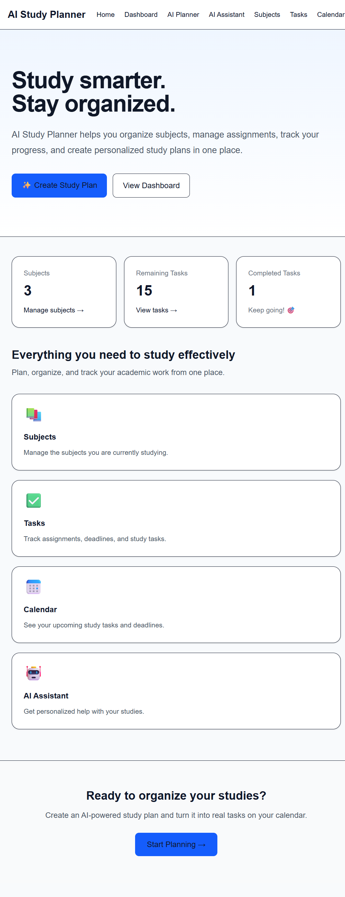
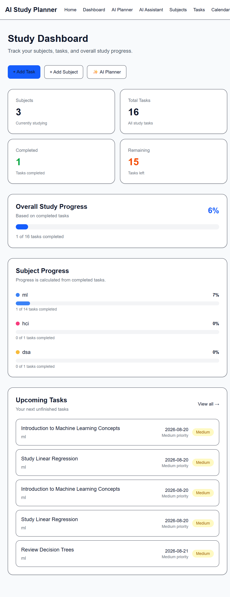
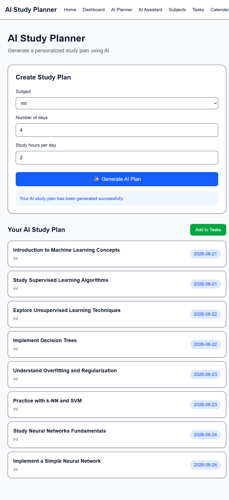
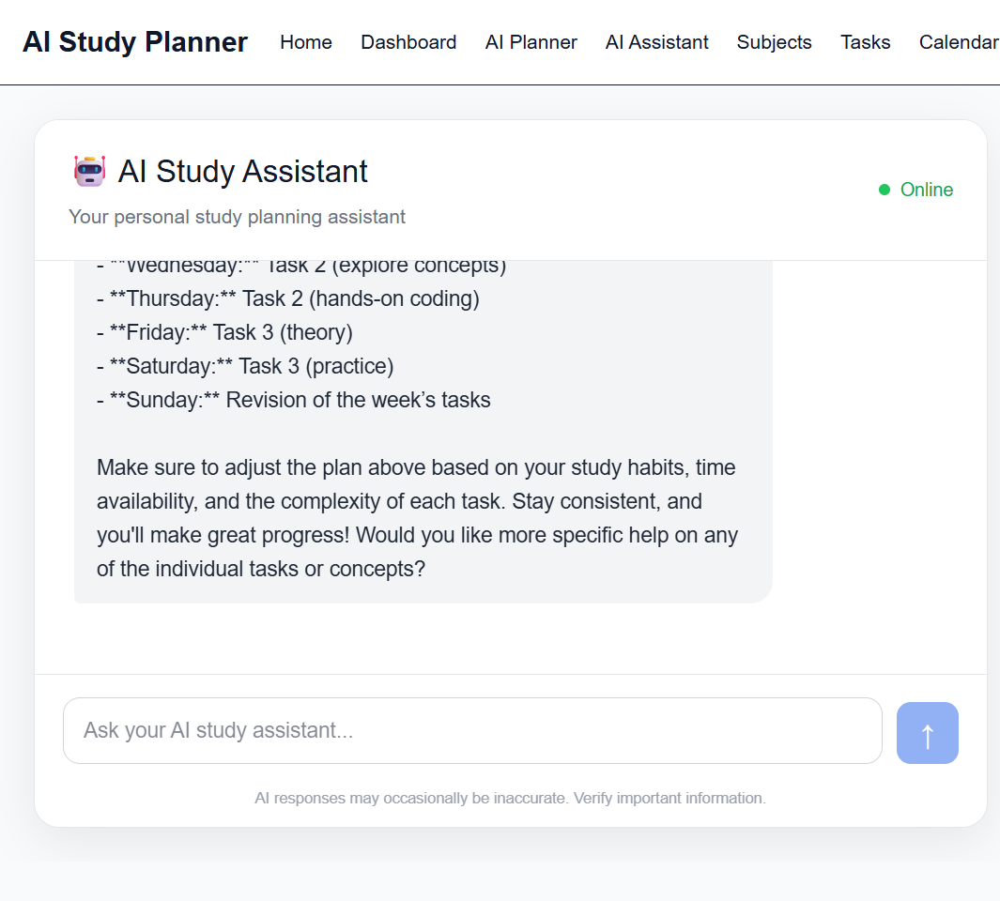
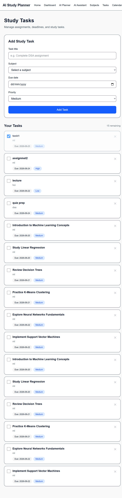

# AI Study Planner

AI Study Planner is a responsive web application that helps students organize their academic work, manage study tasks, track progress, generate personalized AI study plans, and get help from an AI study assistant.

## Live Demo

**Production:** https://ai-study-planner-umama6.vercel.app

**GitHub:** https://github.com/umamamunir6/ai-study-planner

---

## Features

- Dashboard for viewing overall study activity
- Subject management
- Study task management
- Task completion tracking
- Calendar for upcoming tasks and deadlines
- AI-powered study plan generation
- AI Study Assistant with streaming responses
- AI study progress tool
- AI-generated study sessions can be added directly to Tasks
- Persistent study data using browser localStorage
- Loading, error, empty, and success states
- Keyboard-accessible controls
- Responsive interface

---

## Screenshots

### Home



### Dashboard



### AI Study Planner



### AI Study Assistant



### Tasks



---

## Tech Stack

- **Next.js** — application framework and routing
- **React** — user interface
- **TypeScript** — type safety
- **Tailwind CSS** — styling and responsive design
- **AI SDK** — streaming AI responses and tool integration
- **OpenRouter** — AI model provider
- **Vercel** — production deployment
- **GitHub** — source control
- **localStorage** — client-side persistence

---

## Application Pages

The application includes the following main pages:

| Page | Purpose |
|---|---|
| Home | Introduction and quick study statistics |
| Dashboard | Overview of study activity and progress |
| Subjects | Manage subjects |
| Tasks | Create, complete, and delete study tasks |
| Calendar | View upcoming study tasks |
| AI Planner | Generate personalized AI study plans |
| AI Assistant | Chat with an AI study assistant |

---

## AI Features

### AI Study Planner

The AI Planner allows a student to:

1. Select a subject.
2. Choose the number of study days.
3. Set study hours per day.
4. Generate a personalized study plan using AI.
5. Review the generated study sessions.
6. Add the generated sessions directly to Tasks.

The generated study sessions are converted into tasks with dates and a default medium priority.

### AI Study Assistant

The AI Study Assistant provides a streaming conversational interface for academic help.

It can:

- Explain difficult concepts.
- Help with programming and algorithms.
- Suggest study strategies.
- Create study plans.
- Break topics into smaller tasks.
- Answer questions about the student's study data.
- Show study progress using the study progress tool.

The assistant includes:

- Streaming responses
- Stop button during generation
- Retry functionality after errors
- Suggested questions
- Loading/thinking state
- Error state
- Study progress visualization

### Study Progress Tool

The AI Assistant includes a server-side `getStudyProgress` tool.

The tool uses the student's actual subjects and tasks to calculate structured progress information such as:

- Completed tasks
- Total tasks
- Completion rate
- Subject-level progress

This prevents the assistant from inventing progress information when answering questions about the student's study status.

---

## Architecture

The application uses the Next.js App Router.

```text
ai-study-planner/
│
├── app/
│   ├── api/
│   │   ├── chat/
│   │   │   └── route.ts
│   │   └── planner/
│   │       └── route.ts
│   │
│   ├── ai-assistant/
│   ├── planner/
│   ├── dashboard/
│   ├── subjects/
│   ├── tasks/
│   ├── calendar/
│   │
│   ├── components/
│   │   └── ...
│   │
│   └── page.tsx
│
├── lib/
│   ├── ai.ts
│   └── tools/
│       └── studyProgress.ts
│
├── screenshots/
│
├── AUDIT.md
├── README.md
├── package.json
└── ...

### Client-side application

The main pages manage the user interface and study data.

Study subjects and tasks are persisted using browser localStorage.

### Server-side AI routes

AI requests are handled through Next.js API routes.

The API credentials remain server-side and are not exposed directly to the browser.

### AI Assistant flow
User
  ↓
AI Assistant UI
  ↓
/api/chat
  ↓
AI SDK
  ↓
OpenRouter model
  ↓
Streaming response
  ↓
AI Assistant UI

When the user asks about study progress, the assistant can call:

getStudyProgress

The structured result is then displayed in the interface.

### AI Planner flow
User selects subject + days + hours
              ↓
        /api/planner
              ↓
          AI model
              ↓
     Generated study sessions
              ↓
       AI Planner interface
              ↓
          Add to Tasks
## Data Persistence

The current application uses browser localStorage for study data.

The following data is persisted:

Subjects
Tasks

This approach keeps the project simple and avoids requiring a database for the current version.

Because the data is stored locally in the browser, it is specific to the browser/device being used.

## Accessibility

Accessibility improvements were implemented .

The application includes:

Semantic HTML landmarks
Proper form labels
Keyboard-accessible controls
Visible keyboard focus states
Accessible button labels
Accessible form validation messages
ARIA status messaging
Keyboard-accessible AI controls
Keyboard-reachable Stop button for streaming AI responses
Appropriate empty and error states

The AI interface also provides status information for dynamic content.

A keyboard-only pass was performed through the primary application flow, including the AI Assistant.

WAVE was used to audit key application pages.

The detailed accessibility and Lighthouse audit is documented in:

AUDIT.md

## Performance

The application was tested using Lighthouse's mobile preset.

Performance scores can vary between runs because Lighthouse results are affected by:

Network conditions
CPU throttling
Browser state
Caching
Deployment conditions

Performance improvements included reducing unnecessary client-side work and optimizing individual pages where Lighthouse identified opportunities.

The final Lighthouse results and before/after measurements are documented in:

AUDIT.md

## Production Safety

The AI chat route includes safeguards to reduce unnecessary API usage.

Request limits

The route limits:

Maximum number of messages in a conversation
Maximum length of an individual message

Requests exceeding these limits are rejected.

Streaming timeout

The AI chat route uses a maximum streaming duration:

export const maxDuration = 30;

This prevents a streaming request from running indefinitely.

Server-side API key

The OpenRouter API key is only used on the server.

It is not exposed through client-side code.

## Environment Variables

Create a .env.local file in the project root.

OPENROUTER_API_KEY=your_api_key_here
Variable	Purpose
OPENROUTER_API_KEY	API key used for accessing the AI model through OpenRouter

Never commit .env.local or expose the API key in client-side code.

## Running Locally
1. Clone the repository
git clone https://github.com/umamamunir6/ai-study-planner.git
2. Enter the project directory
cd ai-study-planner
3. Install dependencies
npm install
4. Create the environment file

Create:

.env.local

Add:

OPENROUTER_API_KEY=your_api_key_here
5. Start the development server
npm run dev
6. Open the application

Open:

http://localhost:3000

## Production Build

To verify that the application builds successfully:

npm run build

To run the production server locally after building:

npm start

## Deployment

The application is deployed to Vercel.

Production URL:

https://ai-study-planner-umama6.vercel.app

The production deployment uses the required environment variable:

OPENROUTER_API_KEY

## Technical Decisions
Next.js App Router

Next.js was selected for routing, React-based UI development, server-side API routes, and straightforward Vercel deployment.

TypeScript

TypeScript is used throughout the application to provide type safety for subjects, tasks, study sessions, AI data, and component state.

Tailwind CSS

Tailwind CSS is used to create the responsive interface and maintain consistent styling.

localStorage

localStorage was selected for the current version because the project does not require a database. It provides simple persistence for subjects and tasks while keeping the application lightweight.

AI SDK

The AI SDK provides the streaming chat functionality and structured tool integration used by the AI Study Assistant.

OpenRouter

OpenRouter is used as the AI model provider through a server-side configuration.

Server-side AI processing

AI requests are handled through server routes so the API key is not exposed to the client.

## Testing and Verification

The application was tested through:

Production deployment testing
Lighthouse mobile audits
WAVE accessibility audits
Keyboard-only navigation
AI streaming tests
AI Planner generation tests
AI Planner → Tasks flow
Task creation and completion
Calendar task display
Error and empty-state testing
Production AI Assistant testing

The detailed audit is available in:

AUDIT.md

## How AI Tools Were Used

AI tools were used as development assistants throughout the project.

They were used for:

Component scaffolding
TypeScript implementation
Accessibility improvements
Form validation
AI SDK integration
Streaming chat implementation
Structured AI tool integration
Error and empty states
Performance optimization suggestions
Debugging build and deployment issues
Documentation assistance

AI-generated suggestions were reviewed and adapted to the application's requirements.

Implementation was verified by running the application, testing functionality, running production builds, and using Lighthouse and WAVE for accessibility and performance verification.

AI tools were therefore used as part of the development workflow, while final implementation and verification were performed on the project itself.